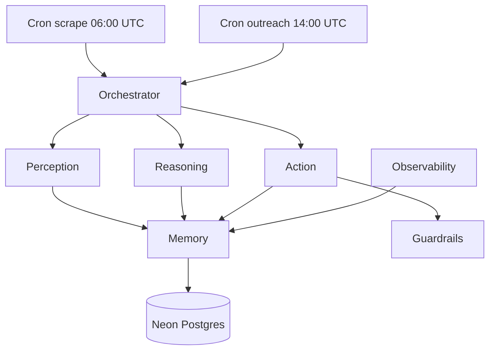

# Talent Bridge Agent

**60-second pitch:** TalentBridge is an autonomous staffing outreach agent. It scrapes US/EU remote job boards daily, uses OpenAI to score fit for a talent-arbitrage model (Philippines, India, Ethiopia at 40–60% of US cost), discovers business contact emails, drafts personalized outreach, and tracks the full pipeline on a live dashboard — deployed on Vercel with Neon Postgres.

## Architecture



Seven layers: **Perception** (scrapers), **Memory** (DB + LLM cache), **Reasoning** (OpenAI filter), **Planning** (orchestrator), **Action** (discover, draft, send), **Guardrails**, **Observability**.

## Local development

```bash
git clone <repo>
cd Job_hunter_agentic_AI
pnpm install
cp .env.example .env.local
# Fill DATABASE_URL (Neon), OPENAI_API_KEY, Gmail app password, secrets
pnpm db:push
pnpm dev
```

Open [http://localhost:3000](http://localhost:3000).

### Neon setup

1. Create a free project at [neon.tech](https://neon.tech).
2. Copy the pooled connection string into `DATABASE_URL`.
3. Run `pnpm db:push` to apply schema.

### Gmail App Password

1. Enable 2FA on the Google account.
2. Google Account → Security → App passwords.
3. Generate a 16-character password for “Mail”.
4. Set `GMAIL_USER` and `GMAIL_APP_PASSWORD` in `.env.local`.

## Vercel deploy

1. Import the repo in Vercel.
2. Add all variables from `.env.example`.
3. Connect Neon `DATABASE_URL`.
4. Crons are configured via `vercel.json` (2 jobs — Hobby limit).
5. Set `CRON_SECRET` and send `Authorization: Bearer <secret>` from Vercel cron.

## Going live

1. Deploy with `DRY_RUN=true` (default).
2. Monitor the dashboard for 24h — confirm scrape, filter, and draft rows.
3. Flip `DRY_RUN` to `false` in Settings (DB-backed) or env when ready.
4. Adjust `DAILY_EMAIL_LIMIT` (default 100; cron sends max 30/run).

## Cost estimate (per 1,000 postings)

| Step | Model | Approx. tokens | Est. cost |
|------|--------|----------------|-----------|
| Filter (200 batches × 5) | gpt-4o-mini | ~2M in / 400k out | ~$0.50–$1.50 |
| Draft (~200 emails) | gpt-4o | ~400k in / 200k out | ~$3–$8 |

Highly dependent on description length and cache hit rate (`llm_cache` table).

## Legal disclaimer

**Cold email is regulated under CAN-SPAM (US), GDPR (EU/UK), CASL (Canada), and others. The user is solely responsible for compliance in every jurisdiction they email. Recommend consulting a lawyer before flipping `DRY_RUN=false`.**

## Troubleshooting

| Issue | Fix |
|-------|-----|
| Gmail `535 Authentication failed` | Use App Password, not account password; 2FA required |
| Neon connection limit | Use pooled URL; reduce concurrent cron + dev |
| Vercel cron not firing | Hobby: max 2 crons; verify `CRON_SECRET` header |
| 60s timeout | Pipeline bounds: 50 postings / 30 emails per run |

## Scripts

- `pnpm dev` — local server
- `pnpm build` — production build
- `pnpm test` / `pnpm test:coverage` — Vitest
- `pnpm db:generate` / `pnpm db:push` / `pnpm db:studio` — Drizzle

## License

Private — use responsibly.
