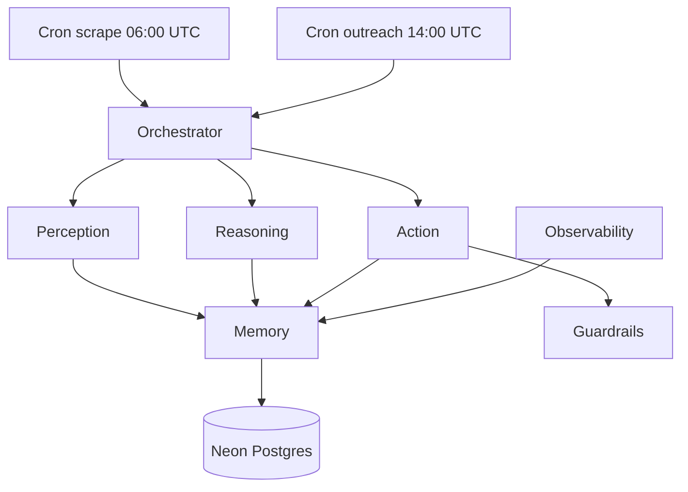

# Talent Bridge Agent

**60-second pitch:** TalentBridge is an autonomous staffing outreach agent. It scrapes US/EU remote job boards daily, uses Gemini to score fit for a talent-arbitrage model (Philippines, India, Ethiopia at 40–60% of US cost), discovers business contact emails, drafts personalized outreach, and tracks the full pipeline on a live dashboard — deployed on Vercel with Neon Postgres.

## Architecture


```mermaid
flowchart TB
  cronScrape[Cron scrape 06:00 UTC]
  cronOutreach[Cron outreach 14:00 UTC]
  orchestrator[Orchestrator]
  perception[Perception]
  memory[Memory]
  reasoning[Reasoning]
  action[Action]
  guardrails[Guardrails]
  observability[Observability]
  neon[(Neon Postgres)]

  cronScrape --> orchestrator
  cronOutreach --> orchestrator
  orchestrator --> perception
  orchestrator --> reasoning
  orchestrator --> action
  perception --> memory
  reasoning --> memory
  action --> guardrails
  action --> memory
  observability --> memory
  memory --> neon
```

Seven layers: **Perception** (scrapers), **Memory** (DB + LLM cache), **Reasoning** (Gemini filter), **Planning** (orchestrator), **Action** (discover, draft, send), **Guardrails**, **Observability**.

## Local development

```bash
git clone <repo>
cd Job_hunter_agentic_AI
pnpm install
cp .env.example .env.local
# Fill DATABASE_URL (Neon), GEMINI_API_KEY, Gmail app password, secrets
pnpm db:push
pnpm dev
```

Open [http://localhost:3000](http://localhost:3000).

### Neon setup

1. Create a free project at [neon.tech](https://neon.tech).
2. Copy the pooled connection string into `DATABASE_URL`.
3. Run `pnpm db:push` to apply schema.

### Gmail App Password

1. Enable 2FA on the Google account.
2. Google Account → Security → App passwords.
3. Generate a 16-character password for “Mail”.
4. Set `GMAIL_USER` and `GMAIL_APP_PASSWORD` in `.env.local`.

## Vercel deploy

1. Import the repo in Vercel.
2. Add all variables from `.env.example`.
3. Connect Neon `DATABASE_URL`.
4. Crons are configured via `vercel.json` (2 jobs — Hobby limit).
5. Set `CRON_SECRET` — Vercel cron sends `Authorization: Bearer <CRON_SECRET>` and `x-vercel-cron: 1` automatically.

## Scraping (Python)

Job scraping runs in **Python** (`scraper/`) for reliability:

| Trigger | How |
|---------|-----|
| **Daily automatic** | Vercel cron `GET /api/cron/scrape` at **06:00 UTC** (Hobby: 2 crons max) |
| **Manual** | Settings → paste `ADMIN_TOKEN` → **Run scrape now** |

Flow: cron/manual → Node orchestrator → **Python** (`/api/py/scrape` on Vercel) → ingest → Gemini filter → contact discovery.

Local manual scrape: `python scraper/run.py --limit 50` (requires `pip install -r scraper/requirements.txt`).

### Indeed from local `npm run dev` (recommended)

Indeed sits behind a Cloudflare "I am not a robot" check that only clears in a
real, on-screen browser, so Indeed scrapes run **on your PC**. The results go
into the same Neon database the deployed app reads, so they show up on the
webapp immediately.

Prerequisites (once):

```powershell
python -m pip install -r api/py/requirements.txt   # playwright, bs4, curl_cffi
python -m playwright install chromium                # only if no Chrome/Edge is installed
```

`.env.local` needs at least `DATABASE_URL`, `ADMIN_TOKEN`, `GEMINI_API_KEY`
(the dev server refuses to boot without the Gemini key; `vercel env pull` fetches
it if it is set in Vercel).

Then:

1. `npm run dev` and open <http://localhost:3000/settings>, paste `ADMIN_TOKEN`.
2. Under **USA → Indeed**, click a role. A Chrome window opens on the Indeed
   search for that role.
3. If Indeed asks you to verify, complete the check in that window — you have
   **30 seconds** (`INDEED_VERIFY_WAIT`). Scraping starts the moment the job
   cards appear; the window closes on its own.
4. The jobs are inserted, then the Gemini relevance filter runs and the toast
   reports how many are relevant. Progress lines from the scraper are printed in
   the `npm run dev` terminal as `[scrape:indeed] …`.

The Chrome profile lives in `.playwright/indeed` and keeps the Cloudflare
clearance cookie, so later clicks usually skip the check entirely.

Knobs (all optional, in `.env.local`): `INDEED_VERIFY_WAIT` (seconds for the
human check, default 15), `INDEED_SCRAPE_TIMEOUT_MS` (whole-run budget, default
90000), `INDEED_BROWSER_PATH` (explicit browser executable), `PYTHON` (interpreter
to spawn, default `python`).

### Indeed local browser worker for Vercel

Vercel cannot open a browser on your computer, so Indeed button clicks are
placed in Neon and picked up by a worker running on your PC. No inbound port or
tunnel is required.

1. Deploy this version so Vercel creates the `indeed_scrape_jobs` table.
2. Optionally set `INDEED_WORKER_TOKEN` in Vercel (otherwise use `ADMIN_TOKEN`).
3. On the PC that has Chrome, Edge, Brave, or Chromium installed:

```powershell
python -m pip install -r api/py/requirements.txt
$env:TALENTBRIDGE_URL="https://your-app.vercel.app"
$env:INDEED_WORKER_TOKEN="the-same-token-set-on-vercel"
python scripts/indeed_worker.py
```

Keep that terminal running. Clicking an Indeed scrape button on the deployed
Settings page will enqueue the request; within a few seconds the worker opens
the local browser, uploads the jobs, and the page continues with filtering.
Use `python scripts/indeed_worker.py --url ... --token ... --once` to process a
single queued request and exit.

Optional GitHub Actions backup (`.github/workflows/scrape-python.yml`): set repo secrets `APP_URL` + `CRON_SECRET` for ingest at 06:30 UTC.

## Going live

1. Deploy with `DRY_RUN=true` (default).
2. Monitor the dashboard for 24h — confirm scrape, filter, and draft rows.
3. Flip `DRY_RUN` to `false` in Settings (DB-backed) or env when ready.
4. Adjust `DAILY_EMAIL_LIMIT` (default 100; cron sends max 30/run).

## Cost estimate (per 1,000 postings)

| Step | Model | Approx. tokens | Est. cost |
|------|--------|----------------|-----------|
| Filter (200 batches × 5) | Gemini 3.5 Flash-Lite | ~2M in / 400k out | Free within API quota |
| Draft (~200 emails) | Gemini 3.5 Flash-Lite | ~400k in / 200k out | Free within API quota |

Highly dependent on description length and cache hit rate (`llm_cache` table).

## Legal disclaimer

**Cold email is regulated under CAN-SPAM (US), GDPR (EU/UK), CASL (Canada), and others. The user is solely responsible for compliance in every jurisdiction they email. Recommend consulting a lawyer before flipping `DRY_RUN=false`.**

## Troubleshooting

| Issue | Fix |
|-------|-----|
| Gmail `535 Authentication failed` | Use App Password, not account password; 2FA required |
| Neon connection limit | Use pooled URL; reduce concurrent cron + dev |
| Vercel cron not firing | Hobby: max 2 crons; verify `CRON_SECRET` header |
| 60s timeout | Pipeline bounds: 50 postings / 30 emails per run |

## Scripts

- `pnpm dev` — local server
- `pnpm build` — production build
- `pnpm test` / `pnpm test:coverage` — Vitest
- `pnpm db:generate` / `pnpm db:push` / `pnpm db:studio` — Drizzle

## License

Private — use responsibly.
